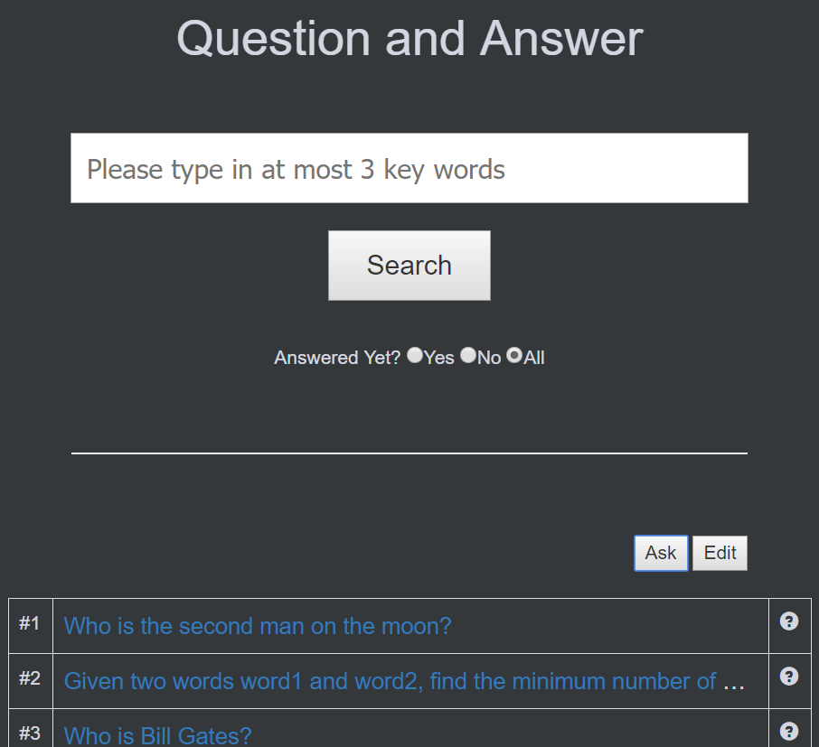
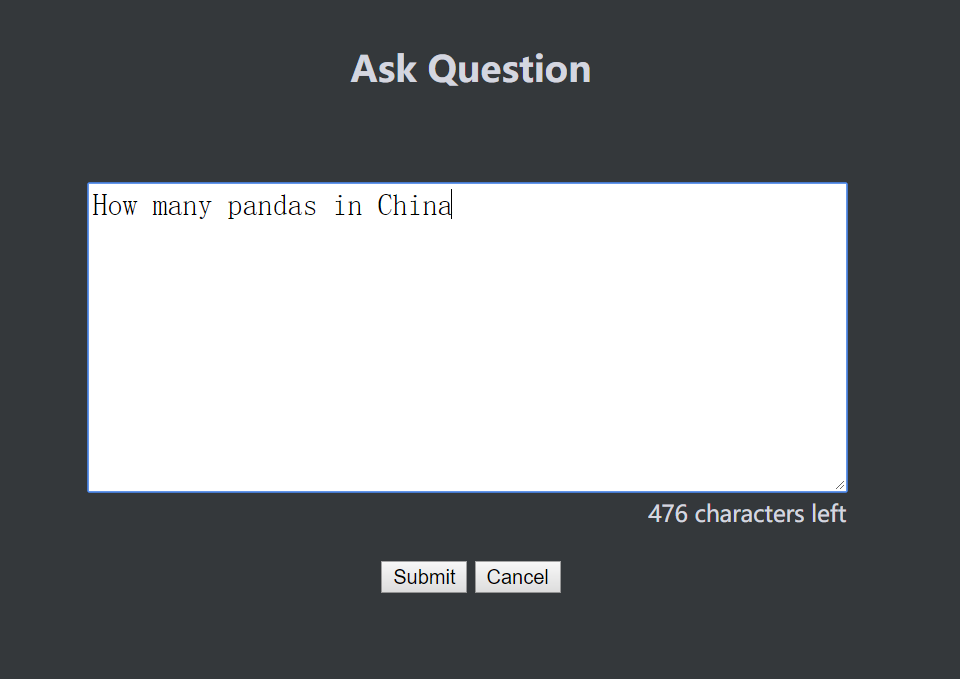
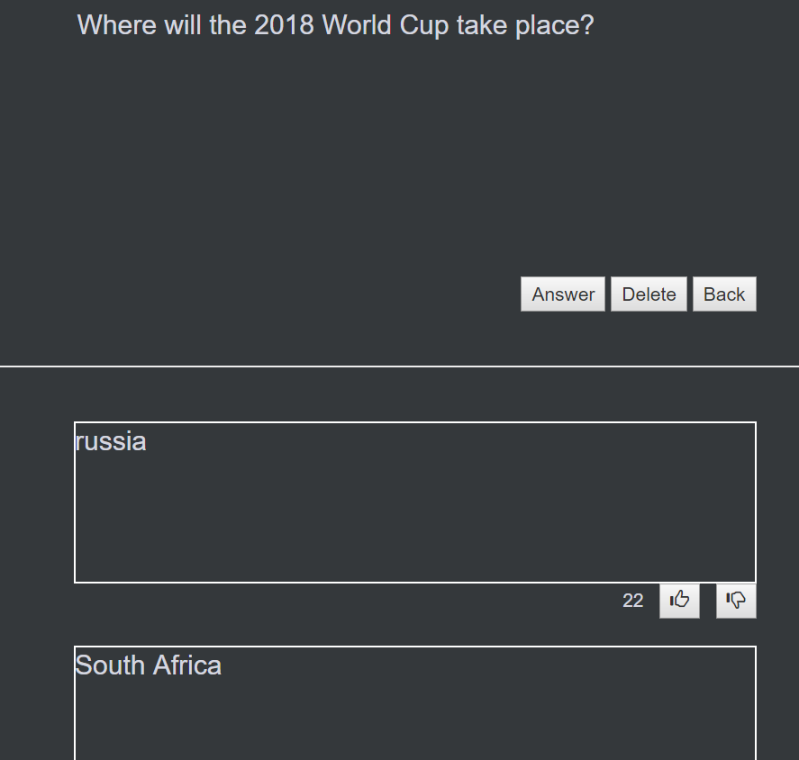

## 说明
* 输入框最大长度60字符，只能输入大小写字母和数字和空格，获取前三个词作为关键搜索词，若少于三个，有个用几个。输入为空或只有空格时作全检索
* radio button选项，yes,no,all分别表示选择已回答的问题，未回答的问题，所有问题
* 点击edit按钮时，ask按钮变更为cancel，edit变更为delete，首列变更为checkbox，可以点击选择。此时点击cancel，全部恢复到之前的状态，点击delete，如果没有选中任何项目则alert提示，若选中至少一条，alert提示是否要删除选中所有问题，是则删除所有选中的问题，并ajax刷新显示结果，否则无动作
* 检索结果首列为序号，2列为问题，最多显示30个字符，其余部分用...表示，链接会跳转到detail.html页面，鼠标悬浮在该列会popup显示全部问题字符。3列是创建日期，4列为是否被回答。
* 显示结果按创建时间降序排列

* 缩进到手机屏幕时(width<500px)，隐藏3列日期，并且问题显示字符数目缩减为20字符

* 点击ask跳转到ask界面，输入框最多输入500字符，右下角动态显示剩余可输入字符
* 点击submit时检查问题是否为空,不为空则向数据库插入这一条数据

* 问题详细页面，显示问题全部内容。点击answer跳转到answer页面，点击delete删除所有问题及答案
* 每条回答都有一个评分，点击up评分加一，点击down评分减一，点击时ajax更新数据库并实时显示评分

